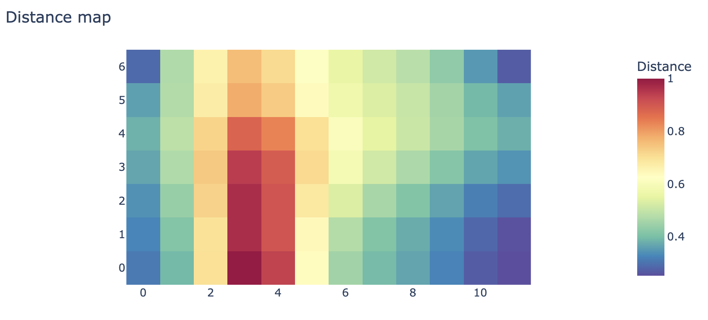
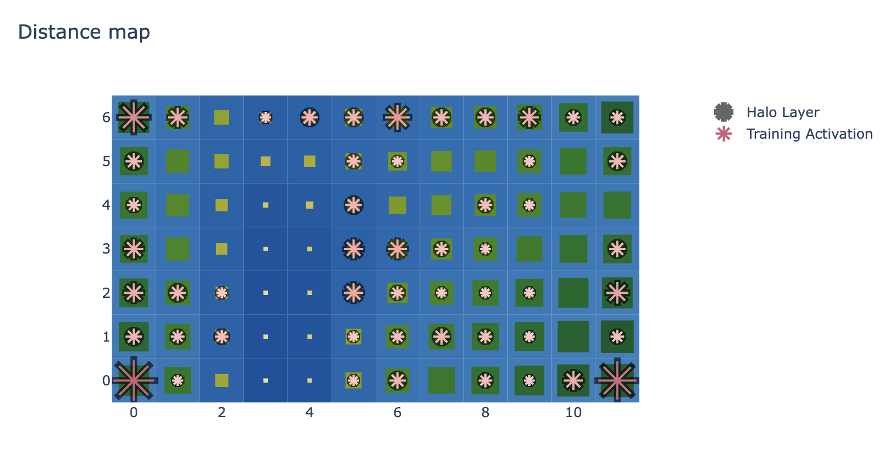
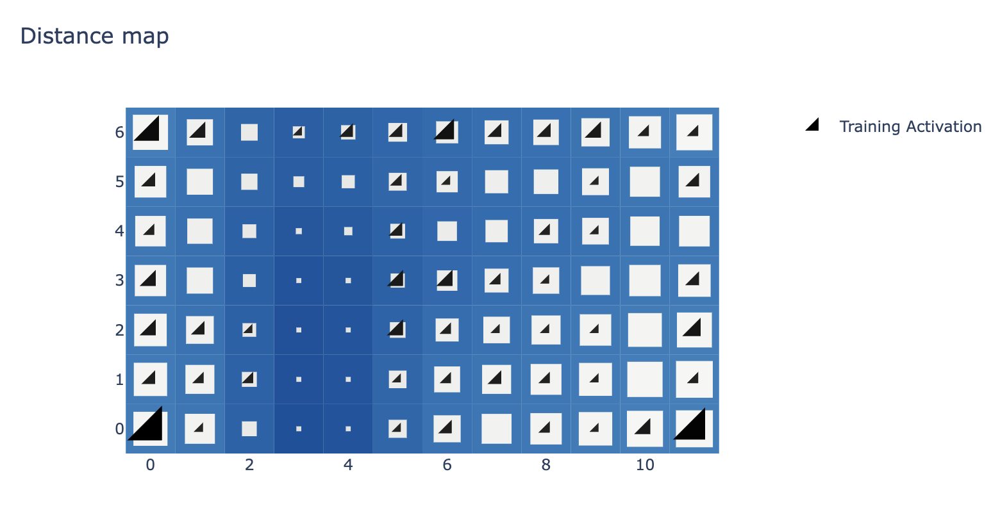
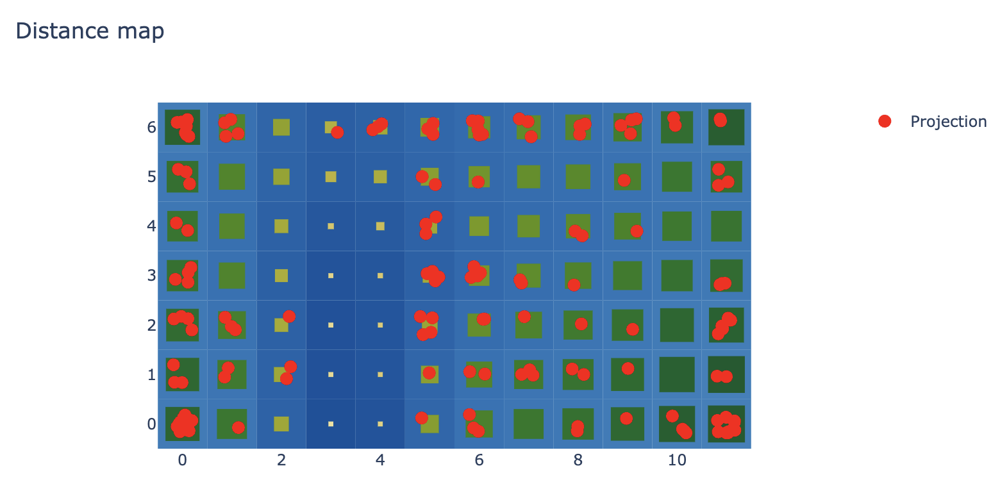
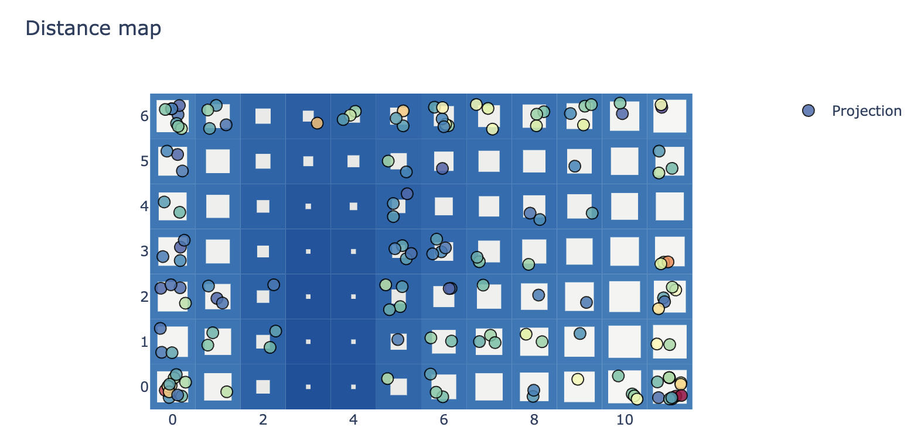

<div align="left">
    
    
</div>

---

# Lilypond

🪷 Lilypond is an intuitive visualization tool for high-dimensional data using Self-Organizing Maps (SOM).

Lilypond uses [MiniSom](https://github.com/JustGlowing/minisom) for fitting the data and [Plotly](https://plotly.com/) for rendering,
adding nature-inspired visual enhancements to standard Self-Organizing Map plots.

This repository is a successor of the [Matplotlib](https://matplotlib.org)-based prototype library developed at [matthew-balogh/lilypond](https://github.com/matthew-balogh/lilypond).


## Installation

```
pip install git+https://github.com/ophelia-rnd/lilypond
```

## Quick Start

```python
from lilypond import Basin
# given dataset X

# prepare for the pond with a `Basin`
basin = Basin.from_data(X, random_seed=42, verbose=True).prepare()

# display the legacy visualization
basin.legacy_pond().visualize_distance_map();
```


```python
# display the enhanced visualization
basin.pond() \
    .pad_layer() \
    .petal_layer() \
    .visualize();
```


```python
# alternatively, utilize the `iceflock` default theme instead of the `pond`
basin.pond(style_name="iceflock") \
    .pad_layer() \
    .petal_layer() \
    .visualize();
```


```python
# leverage out-of-box sample-wise projection function
basin.pond() \
    .pad_layer() \
    .attraction_layer(X) \
    .visualize();
```


```python
# with customization supported
#   e.g.: use the quantization error measured from best-matching unit as the color of the projected sample
import numpy as np
X_quantization_errors = np.linalg.norm(basin.som.quantization(X) - X, axis=1)
custom_marker = dict(opacity=.85, size=10, color=X_quantization_errors, colorscale="Spectral_r", line=dict(width=1, color="black"))
basin.pond(style_name="iceflock") \
    .pad_layer() \
    .attraction_layer(
        X,
        jitter_amount=.3,
        marker=custom_marker
    ) \
    .visualize();
```

