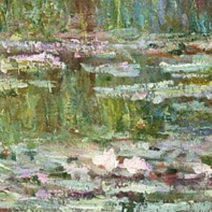
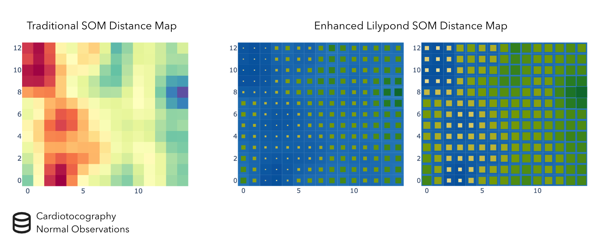
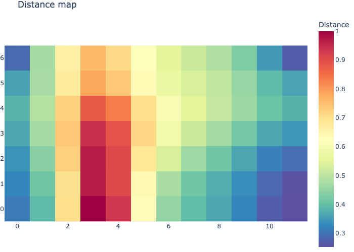
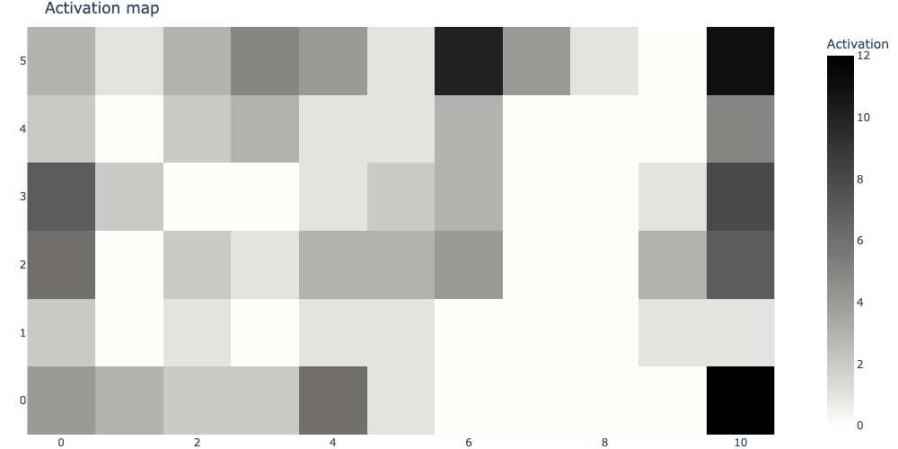
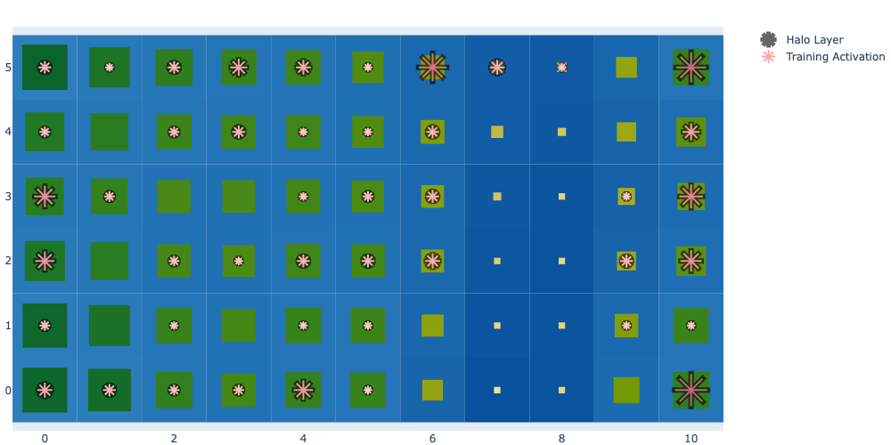
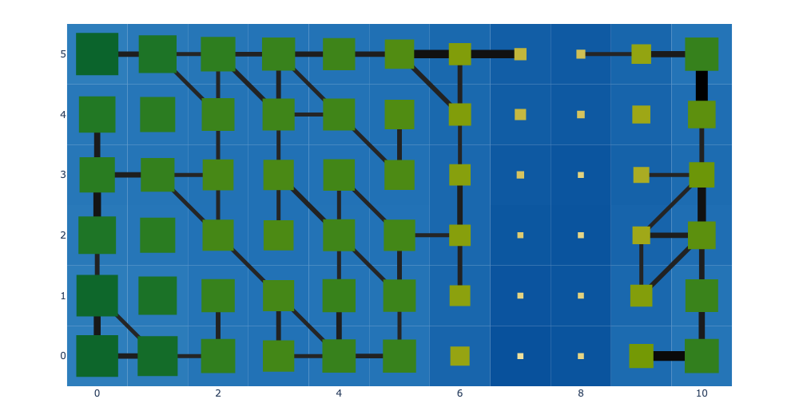
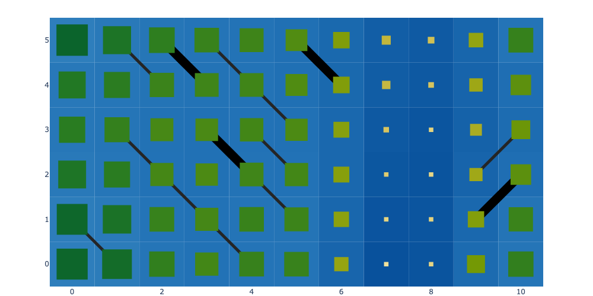
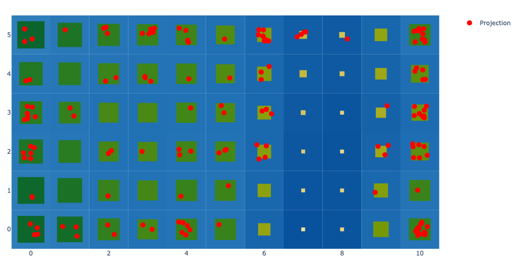
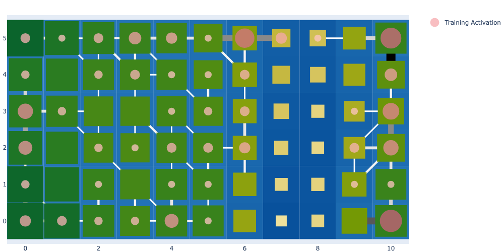
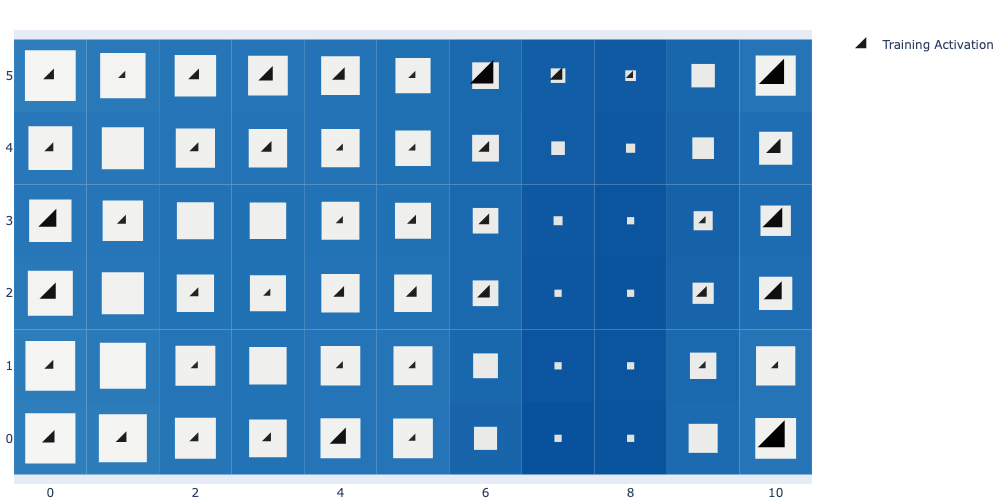

<div align="left">




</div>

------------------------------------------------------------------------

# Lilypond

🪷 Lilypond is an intuitive visualization tool for high-dimensional data
leveraging the representation learning capability of Self-Organizing
Maps (SOM).



## Details

Lilypond uses [MiniSom](https://github.com/JustGlowing/minisom) for
fitting the data and [Plotly](https://plotly.com/) for rendering, adding
nature-inspired visual enhancements to standard Self-Organizing Map
plots.

This repository is a successor of the
[Matplotlib](https://matplotlib.org)-based prototype library developed
at
[matthew-balogh/lilypond](https://github.com/matthew-balogh/lilypond).

## Installation

``` {bash}
pip install git+https://github.com/ophelia-rnd/lilypond
```

## Quick Start

``` python
# load and scale Iris dataset
from sklearn.datasets import load_iris
from sklearn.preprocessing import StandardScaler
X, y = load_iris(return_X_y=True, as_frame=False)
X_scaled = StandardScaler().fit_transform(X)
```

``` python
# prepare for the pond with a `Basin`
from lilypond import Basin
basin = Basin.from_data(X_scaled, random_seed=42, verbose=False).prepare()
```

### Legacy visualization

``` python
basin.legacy_pond().visualize_distance_map();
```



### Enhanced visualization

``` python
basin.pond() \
    .pad_layer() \
    .petal_layer() \
    .visualize(width=1000);
```



``` python
# display 1st and 2nd BMU connections of training data
basin.pond() \
    .rhizome_layer() \
    .pad_layer() \
    .visualize(width=1000);
```



``` python
# display 1st and 2nd BMU connections of training data
#   that violate Von-Neumann neighborhood constraint
basin.pond() \
    .rhizome_layer(violations_only=True, neighborhood="von-neumann") \
    .pad_layer() \
    .visualize(width=1000);
```



``` python
# leverage out-of-box sample-wise projection function
basin.pond() \
    .pad_layer() \
    .attraction_layer(X_scaled) \
    .visualize(width=1000);
```



### Themes and customization

``` python
# customize layers
basin.pond() \
    .rhizome_layer(min_width=3, max_width=18, colorscale="Greys") \
    .pad_layer(gap="nogap", min_fraction=.3) \
    .petal_layer(min_size=12, max_size=42, marker=dict(symbol="circle", opacity=.75), hide_halo=True) \
    .visualize(width=1000);
```



``` python
# utilize the `iceflock` default theme instead of the `pond`
basin.pond(base_style="iceflock") \
    .pad_layer() \
    .petal_layer() \
    .visualize(width=1000);
```



``` python
# use the quantization error measured from best-matching unit as the color of the projected sample
import numpy as np

X_quantization_errors = np.linalg.norm(basin.som.quantization(X_scaled) - X_scaled, axis=1)
custom_marker = dict(opacity=.85, size=16, color=X_quantization_errors, colorscale="Spectral_r", line=dict(width=1, color="black"))

basin.pond(base_style="iceflock") \
    .pad_layer() \
    .attraction_layer(
        X_scaled,
        jitter_amount=.3,
        marker=custom_marker
    ) \
    .visualize(width=1000);
```


